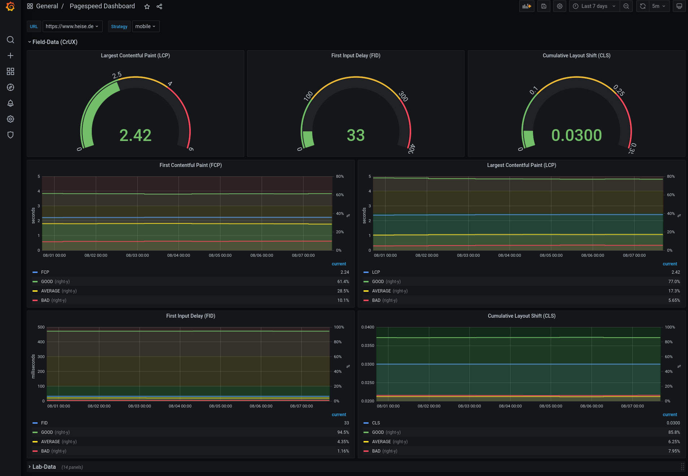

# pagespeed10x

Get regular PageSpeed Insights results and store or visualize them.

| Grafana Dashboard: Row for Lab-Data | Grafana Dashboard: Row for Field-Data (CrUX) |
| --- | --- |
| [](screenshot1.jpeg) | [](screenshot2.png) |

## Requirements

At first, get an [API key for Google PageSpeed Insights](https://developers.google.com/speed/docs/insights/v5/get-started).

You will need Python 3.9 and pip if you just want to run this script from time to time manually.

If you're interested in regular metrics and want to store the data in an InfluxDB 2 and get graphs from Grafana you will need docker (>= 20.10.6) and docker-compose (>= 1.25.0).

## Installation

```bash
git clone https://github.com/maczarr/pagespeed10x.git

cd pagespeed10x

pip install -r requirements.txt
# or run `make` which will do the same and starts the unit tests
```

## Configuration

Everything can be configured through environment variables. There is a `.env.example` in the project containing all available environment variables which you can use as a starting point (`cp .env.example .env`). Of course you still have to fill in the correct values for the environment variables.

| name | example | description |
| ---- | ------- | ----------- |
| PAGESPEED_INSIGHTS_API_KEY | ABCDEFGH-1ABCD<br>_(actually it's longer, but you get the idea)_ | Get an [API key for Google PageSpeed Insights](https://developers.google.com/speed/docs/insights/v5/get-started). You will need it for requesting the API regularly. |
| TESTSITES | `'["https://www.domain1.tld",`<br>`"https://www.domain2.tld"]'` | Here you can add several urls which will be requested if there is no<br>`-u https://domain.tld` argument given when calling the script.<br>**Please note:** Use the exact single and double quotes as shown in the example. |
| INFLUXDB_ON | True | If set to `True` the data will be stored in an InfluxDB 2 |
| INFLUXDB_USER | admin | InfluxDB 2 username |
| INFLUXDB_PASSWORD | _a password_ | Password for the `INFLUXDB_USER` |
| INFLUXDB_TOKEN | _a loooong token_ | Token to communicate with the InfluxDB 2 |
| INFLUXDB_ORG | my_awesome_org | Your InfluxDB 2 organization name |
| INFLUXDB_BUCKET | performance | The InfluxDB 2 bucket to store the data in |
| INFLUXDB_HOST | http://influxdb | URL to the InfluxDB 2 host. **Please note** This must be the name of the influxdb service in `docker-compose.yml` if you're using the docker-compose setup |
| INFLUXDB_PORT | 8086 | Port to access the InfluxDB container from outside |
| GRAFANA_PORT | 3000 |  Port to access the Grafana container from outside |
| DB_SQL_ON | True | If set to `True` the data will be stored in a SQLite3 database |
| DB_SQL_FILENAME | pagespeed10x.sqlite.db | Filename for the SQLite3 database |
| DB_SQL_TABLE | measurements | Name for the table in the SQLite3 database |
| HOST_UID | 1000 | The Grafana container will be run with this UID to prevent volume write-access problems.<br>The SQLite3 database file be set to be owned by this UID aswell. |
| HOST_GID | 1000 | The SQLite3 database file be set to be owned by this GID. |
| VERBOSE | True | If set to `True` results will be put out on the command line. A `VERBOSE=False` can be overruled by the CLI argument `-v` |

## CLI

The script can be run from the command line. It provides some arguments:

| short | long | default | description |
| ----- | ---- | ------- | ----------- |
| -h    | &#x2011;&#x2011;help     | | Help for the cli arguments. |
| -s    | &#x2011;&#x2011;strategy | ['desktop','mobile'] | Choose between 'desktop' or 'mobile', if none is given both will be requested. |
| -c    | &#x2011;&#x2011;comment  | _empty string_ | Add a comment which will be stored in the SQLite3 database if you activated this feature. |
| -u    | &#x2011;&#x2011;url      | `False` | Name the url you want to perform a PageSpeed Insights test for. |
| -v    | &#x2011;&#x2011;verbose  | `False` | This argument doesn't need a value. Just add a `-v` if you want the results to be put out on the command line. |

Full example with output on the command line:

```bash
./pagespeed10x/pagespeed10x.py -s desktop -u https://maczarr.de -c "first test" -v
```

## Usage

### Simple Usage

This is an example for basic usage of the script. The results will be put out on the command line but nothing will be saved.

```bash
./pagespeed10x/pagespeed10x.py -s desktop -u https://maczarr.de -v
```

### Persisting data in a SQLite3 database

Set the `DB_SQL_ON`, `DB_SQL_FILENAME` and `DB_SQL_TABLE` environment variables in your `.env` file. Run the script as before. The SQLite3 database will be created and data will be saved.

```bash
./pagespeed10x/pagespeed10x.py -s desktop -u https://maczarr.de -c "new feature X got added" -v
```

If you want to check more than one url simply use the `TESTSITES` environment variable via the `.env` file and omit the `-u https://domain.tld` argument when calling the script.
If you want to perform a desktop- and mobile-test with one call of the script simply omit the `-s desktop` argument.

**Please note:** If there is any problem with writing data to the SQLite3 database **the script won't stop**. It will just inform you about the problems and will continue running. This choice was made for the reason if someone has the SQL- and InfluxDB-Feature enabled there is chance the data won't get lost and will be at least saved to the InfluxDB.

### Persisting data in an InfluxDB 2 and having a Grafana dashboard

Fill out all the environment variables for InfluxDB 2, Grafana and the `HOST_UID` in your `.env` file.
You can set the urls for testing through the `TESTSITES` environtment variable.

Start the docker containers:

```bash
docker-compose up
```

The first run will take longer for setting everything up but after that it'll be faster.
When everything is ready the `TESTSITES`-urls will be tested every 30th minute (7:00, 7:30, 8:00, 8:30,...).

You can login to the InfluxDB via localhost:8086 (or your specified port) and your login credentials.
The Grafana dashboard is reachable via localhost:3000 (or your specified port). Default credentials on Grafana are `admin:admin`.

The containers are persisting their data in the `storage` folder and the respective sub-folders.

## Grafana

Grafana is pre-configured with a datasource (localhost:3000/datasources) for the InfluxDB using the data from the environment variables and it comes with a dashboard (localhost:3000/dashboards), simply called "Pagespeed Dashboard".

### Thresholds

The thresholds used in the Grafana dashboard are taken from the corresponding web.dev pages for the metrics. Of course they can simply be adjusted within Grafana (the dashboard is configured as `editable`).

## Tests

This project has some basic unittests. You can run them by calling `nose2` in the projects main folder.
If you have `make` on your machine you can simply run `make` after cloning the project. It will install all requirements and will run the tests.
